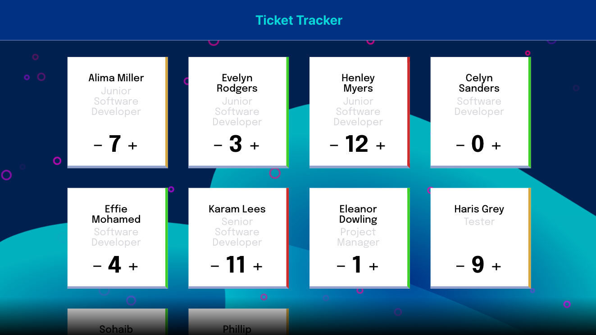
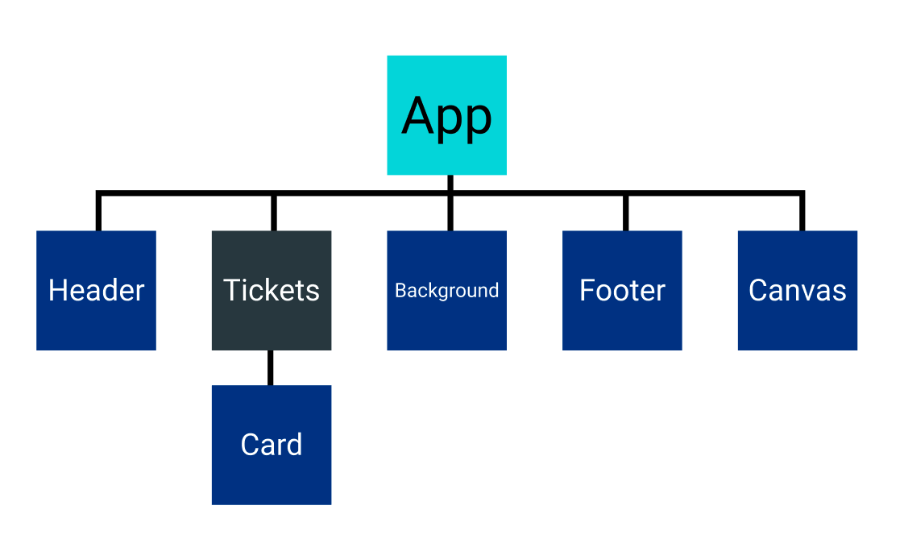

# React Ticket Tracker Project

## Project Overview

The aim of this project was to cement foundational knowledge of React. The task was to create a ticket tracker that could be utilised by a team to keep track of how many tickets (tasks) each team member had left to complete.

## Design Approach

_Component Tree of Ticket Tracker_

Mock data was to be imported into app component. This data was then passed down as a prop to the tickets component. Each card was rendered based on props past down from the tickets component. Therefore, by passing down functions as props to the card components, each card state could be lifted up to the tickets component.

Lifting up card state enabled features to be added such as filtering cards visiblity based on colour.

Card colour was another feature enabled by lifting up the state of each card. By lifting up card state an average count could be calculated. Therefore, each card could be coloured in relation to all other cards. This feature was added so that members of a team using the ticket tracker could assess performance and progress in relation to one another.

Buttons were used for all interactive elements so that the user can interact with the app entirely without a mouse if necessary.

HTML Canvas was integrated to make improve the aesthetic of the website. Using an OOP approach, a random number of particles (within limits) at random locations on the page with random colours are created and rendered when the page is loaded.

Noticable on smaller screens, a parallax scroll was added to add movement to the background shapes, giving the page a more dynamic feel.

## Links to Project

### Deployed Site

https://samueljacobs98.github.io/ticket-tracker-project/

### GitHub Repo

https://github.com/samueljacobs98/ticket-tracker-project

### Figma Design

https://www.figma.com/file/lvEKOlJ4pANcegtHaW0uIk/Ticket-Tracker?node-id=0%3A1
